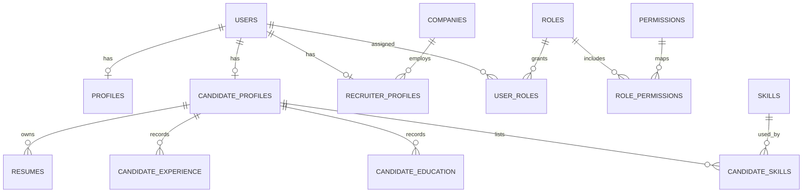

# Recruitment backend foundation

## ER design



`users` contains authentication/account state only. `profiles` has shared identity fields and is one-to-one with users. `user_roles` and `role_permissions` are many-to-many junctions with composite primary keys; roles and permissions remain configurable records, so adding a role does not change schema. Candidate and recruiter extension tables are one-to-one with users. Candidate skills are normalized through `skills` and `candidate_skills`; education, experience and resume metadata are one-to-many. Companies are shared across recruiters. Foreign keys cascade for owned records; company deletion is restricted while recruiters reference it.

The schema indexes email, status, lookup/junction foreign keys, company membership, and candidate child records. Junction primary keys also index their left-hand lookup; explicit reverse indexes support lookups from the other side. No binary resume data is stored here.

## Setup

Copy `.env.example` to `.env`, configure PostgreSQL and secrets, then run `npm install`, `npm run prisma:migrate`, `npm run prisma:seed`, and `npm run dev`. Generate a strong random `JWT_SECRET` (at least 32 bytes). Admin users must be provisioned out of band; public registration accepts CANDIDATE and RECRUITER only. Recruiter registration may optionally provide an existing company UUID; company creation should be permission-gated separately.

## Routes

- `POST /api/auth/register` — candidate/recruiter only; `role` is optional and defaults to CANDIDATE.
- `POST /api/auth/login` — returns short-lived bearer JWT and safe account/profile data.
- `GET/PATCH /api/profile`
- `GET/PATCH /api/candidate/profile`, candidate experience/education/skills/resume metadata routes.
- `GET/PATCH /api/recruiter/profile`
- `GET /api/admin/users`, `PATCH /api/admin/users/:id/status`.

Protected routes use bearer access tokens. JWTs contain only `sub` and role names, never permissions. Authorization queries current role permissions in PostgreSQL on each protected permission check, so permission changes take effect without waiting for token expiry. A cache can be added later with explicit invalidation. Refresh tokens are omitted; clients reauthenticate after the short access token expires.

Errors use `{ success:false, message, code }`; success responses use `{ success:true, message, data }`. Registration/login are rate limited, validation uses Zod, hashing uses Argon2id, Helmet and configurable CORS are enabled. Configure HTTPS and a trusted reverse proxy in production.

## Flows

Registration validates and normalizes email, hashes password, and creates user, common profile, user-role link, and role-specific profile in one Prisma transaction. Any error rolls back all rows. Login normalizes email, verifies active status and Argon2 hash, updates last login, loads role names, then signs a short-lived JWT. For authorization, `authenticate` verifies the token and attaches its subject; `requirePermission('JOB','CREATE')` checks the live database mapping and returns 403 if absent.

Example registration request:

```json
{"email":"candidate@example.com","password":"StrongPassword123!","role":"CANDIDATE","firstName":"Ajay","lastName":"Kumar"}
```

Example successful response:

```json
{"success":true,"message":"Registration successful","data":{"user":{"id":"uuid","email":"candidate@example.com","status":"ACTIVE","roles":["CANDIDATE"]},"accessToken":"<short-lived JWT>"}}
```

Example forbidden response:

```json
{"success":false,"message":"You do not have permission to perform this action.","code":"FORBIDDEN"}
```

Typical parameterized operations are represented with Prisma:

```js
await prisma.user.findUnique({ where: { email: normalizedEmail } });
await prisma.userRole.findMany({ where: { userId }, include: { role: true } });
await prisma.candidateSkill.findMany({ where: { skillId }, select: { candidateId: true } });
```
